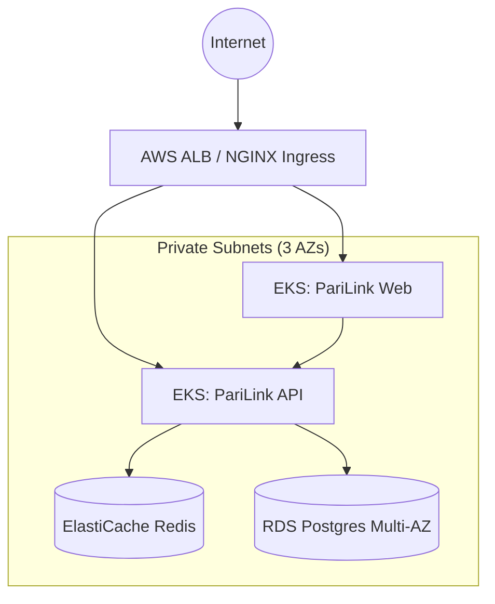

# Cloud Architecture (GA)

## 1. Cloud Provider Baseline
PariLink is designed to be cloud-agnostic via Kubernetes, but the reference architecture and Infrastructure as Code (IaC) baseline is built on **Amazon Web Services (AWS)**.

## 2. Infrastructure Topology

### Compute
- **Amazon EKS (Elastic Kubernetes Service)**: Manages the control plane.
- **EKS Managed Node Groups**: Minimum of 3 instances (`t3.medium`) spread across 3 Availability Zones (AZs) for high availability. 

### Database & Storage
- **Amazon RDS (PostgreSQL 15)**: Multi-AZ deployment for the primary database to ensure 0-data-loss failover. Backups are natively managed by RDS with a 7-day retention period.
- **Amazon ElastiCache (Redis 7)**: Single-node cache for session management and rate-limit tracking. Not configured for Multi-AZ to save costs, as cache loss is an acceptable risk with zero data persistence impact.

### Networking
- **VPC**: A dedicated `/16` VPC partitioned into 3 Public Subnets and 3 Private Subnets.
- **NAT Gateway**: Single NAT Gateway deployed in the public subnet to allow EKS worker nodes (in private subnets) to pull external Docker images.
- **AWS Application Load Balancer (ALB)**: Handled by the NGINX Ingress Controller to route traffic to `app.parilink.com` and `api.parilink.com`.

## 3. Reference Diagram
*(A high-level text representation of the topology)*

